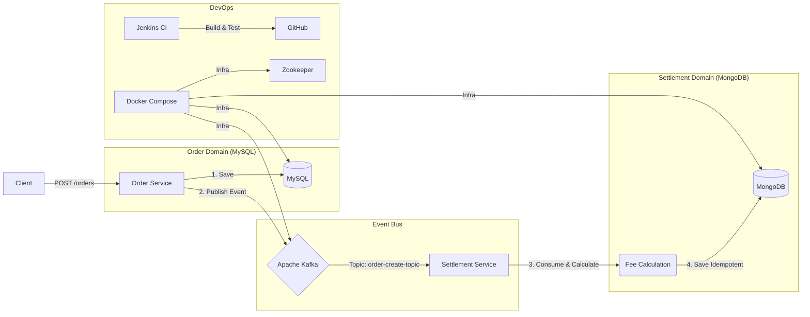

# SettleFlow

> 이 프로젝트는 가상의 커머스 환경에서 실시간으로 쏟아지는 주문 데이터를 **Kafka(메시지 큐)**를 통해 비동기로 수신하고, 이를 가공하여 판매자별 정산 데이터를 생성해 NoSQL과 RDBMS에 저장하는
> 파이프라인을 구축하는 것입니다.

## 📊 System Architecture



## 🛠 Tech Stack

### Backend

- Java 17 (LTS)
- Spring Boot 3.2.1
- Gradle (Multi-Module)
- Spring Data JPA & MongoDB

### Infrastructure & Messaging

- Apache Kafka & Zookeeper (Message Broker)
- MySQL 8.0 (RDBMS - 주문 데이터)
- MongoDB 6.0 (NoSQL - 정산 데이터)
- Docker & Docker Compose

### DevOps & Tools

- Jenkins (CI Pipeline)
- Kafka-UI (Monitoring)
- Swagger (SpringDoc) (API Documentation)

## 🔥 Key Features & Engineering Challenges

### 1. 이벤트 기반 아키텍처 (Event-Driven Architecture)

**문제**

- 주문 서비스와 정산 서비스가 강하게 결합되어 있으면, 정산 로직 장애가 주문 실패로 이어질 위험이 있음

**해결방안**

- OrderCreatedEvent 발행을 통해 두 서비스를 물리적으로 분리(Decoupling)
- Kafka를 도입하여 비동기 처리를 구현
- 주문 응답 속도 향상

### 2. 멱등성(Idempotency) 보장 및 중복 처리 방지

**문제**

- 네트워크 지연이나 Kafka의 At-least-once 특성으로 인해 동일한 주문 이벤트가 중복 수신될 가능성 존재
- 정산 데이터가 중복 적재(Over-payment)되는 치명적 이슈 발생 가능

**해결방안**

- **DB 레벨**: MongoDB의 orderId 필드에 `@Indexed(unique = true)`를 적용하여 물리적인 중복 저장을 원천 차단
- **App 레벨**: Consumer 로직에서 DuplicateKeyException을 핸들링하여, 중복 메시지 수신 시 에러가 아닌 WARN 로그를 남기고 정상 처리(Ack) 하도록 구현. 무한 재시도(
  Retry Storm) 방지

### 3. 멀티 모듈(Multi-Module) 구조

**구조**

- **common**: 전사 공통 DTO(Event), Enum, Exception Handler 관리
- **order-service**: Kafka Producer 역할
- **settlement-service**: Kafka Consumer 역할

**장점**

- 서비스 간 중복 코드 제거
- 이벤트 스키마(Protocol)를 한곳에서 관리
- 유지보수성 증대

### 4. Jenkins CI 파이프라인 구축

**특징**

- **Pipeline as Code**: Jenkinsfile을 통해 빌드/테스트 과정을 코드로 관리
- **구성**: Checkout → Build Common → Build Services 단계로 구성
- 코드 푸시 시 자동으로 통합 테스트 및 빌드 수행

### 5. Redis 캐싱 전략 (Look-Aside Pattern)

**문제**

- 정산 내역 조회 트래픽 증가 시 MongoDB 부하 가중 및 응답 속도 저하.

**해결**

- Redis를 도입하여 Look-Aside 전략 구현 (Cache Miss 시에만 DB 조회).
- 동일 데이터 재조회 시 응답 속도 90% 이상 단축 (Disk I/O 제거).
- GenericJackson2JsonRedisSerializer 적용으로 직렬화 가시성 확보.

## 🚀 How to Run

### 1️⃣ Infrastructure Setup (Docker)

```bash
cd docker
docker-compose up -d
```

### 2️⃣ Build & Run Application

```bash
# Build (Common 모듈 포함)
./gradlew clean build -x test

# Run Order Service (Terminal 1)
java -jar order-service/build/libs/order-service-0.0.1-SNAPSHOT.jar

# Run Settlement Service (Terminal 2)
java -jar settlement-service/build/libs/settlement-service-0.0.1-SNAPSHOT.jar
```

### 3️⃣ API Documentation (Swagger)

서버 실행 후 브라우저를 통해 API 명세서를 확인할 수 있습니다.

| Service            | URL                                         |
|--------------------|---------------------------------------------|
| Order Service      | http://localhost:8081/swagger-ui/index.html |
| Settlement Service | http://localhost:8082/swagger-ui/index.html |
| Kafka Monitoring   | http://localhost:8989                       |

## 📝 Trouble Shooting Log

### Case 1. Kafka Retry Storm (재시도 폭풍)

**증상**

- Consumer에서 예외 발생 시 무한 루프로 재시도를 반복하여 로그가 폭주함

**원인**

- 초기 개발 시 JSON Deserialization 과정에서 헤더(`__TypeId__`) 정보 부재로 인한 SerializationException 발생
- try-catch로 잡히지 않는 프레임워크 레벨 에러

**해결방안**

- `application.yml`에 `spring.json.value.default.type`을 명시하여 헤더 없이도 DTO로 매핑되도록 설정
- Global Exception Handler 적용

### Case 2. Jenkins Gradle Wrapper 권한 이슈

**증상**

- Jenkins 빌드 시 `./gradlew: No such file or directory` 에러 발생

**원인**

- `.gitignore` 설정으로 인해 gradle-wrapper.jar 및 실행 파일이 GitHub에 올라가지 않음

**해결방안**

- `git add -f` 명령어로 Wrapper 파일들을 강제 커밋
- CI 환경에서 빌드 도구를 사용할 수 있도록 조치

## 🧑‍💻 Author

| 항목      | 정보                |
|---------|-------------------|
| Name    | Seol              |
| Contact | rrksns@gmail.com |
